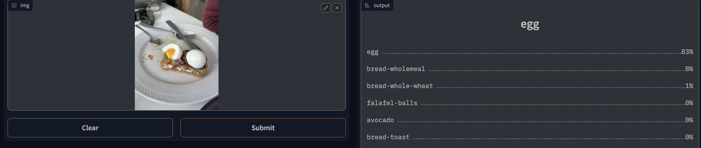
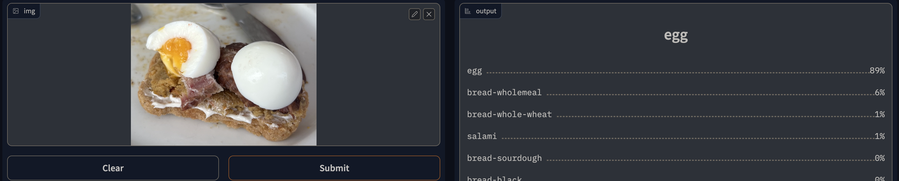
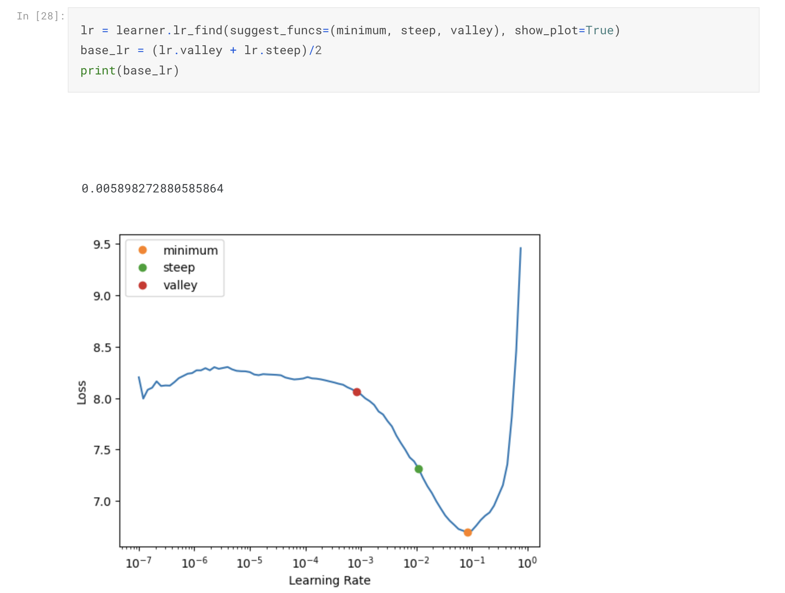
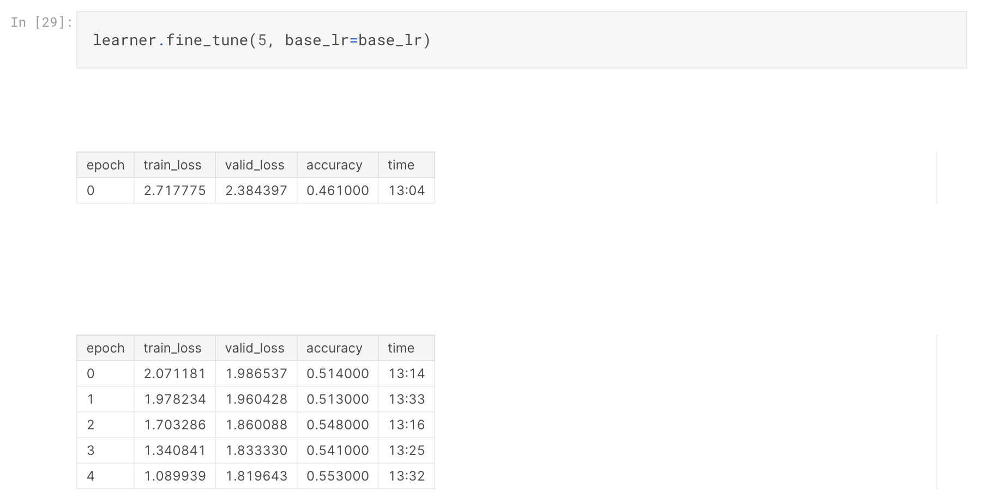

[Kaggle]: https://www.kaggle.com/
[dataset]: https://www.kaggle.com/jaflaten/datasets?scroll=true
[Kaggle notebook]: https://www.kaggle.com/code/jaflaten/food-recog-loader?scriptVersionId=124121986 
[GitHub]: https://github.com/jaflaten/food-recognizer
[application]: https://www.kaggle.com/code/jaflaten/food-recog-app

I have been working on a project to create a application to recognize food in images. This was done using deep learning, a subset of machine learning, to train a model and then create a simple application based on the model. 

### Background

The idea behind this project is that using computer vision based on deep learning it is potentially possible to revolutionize how we track food intake. By creating a system that can automatically recognize food in pictures that would allow for much simpler logging of food intake. Combined with the possibility to recognize which food is in the picture, this could be linked to a database containing nutritional data such as calorie content and macronutrient composition. This could allow people to get a better understanding of how the food they consume impact their overall health, and helping them to make more informed decisions on what they eat and drink. Such a system could also be integrated in other applications and have many positive benefits, such as helping people live a healthier lifestyle, lose weight, or to reach specific fitness goals. 

---

### Objective

The goal of the project as to create a system that could take a image of a set of food images as input and then output the individual food items presented in the image. Thereafter the system should be integrated in a application and possibly explore further how the system can be used for personal health.

---

### Methods and data

The notebook I used is a online tool called [Kaggle], which provides computing power, notebooks, competitions, leaderboards and datasets to use in machine learning. This enables me to do deep learning without having a ton of GPU power on my own machine. Sharing notebooks on [Kaggle] also makes it very easy to recreate the project.

Datasets with images and labels corresponding to those images are required to train a model. These datasets are not always readily available, but in this case I could use a dataset containing 39,962 images food items, with 76,491 annotations spread over 498 food classes. This was published by [aicrowd](https://www.aicrowd.com/challenges/food-recognition-benchmark-2022). The datasets contained images and a annotations.json file with labels in which each image had a label to describe what kind of food was in the image. 

I downloaded three datasets: training, validation and test, all are correlated to the same version of the datasets. At first I attempted to download the datasets directly to my [Kaggle notebook] through code, but this was very slow and not usable. Instead I downloaded them to my local machine and then uploaded each of them to [Kaggle] as a public [dataset]. By having the datasets in [Kaggle] they could be imported into the notebook easily and the waiting time is minimal when starting the notebook.

The annotations.json was loaded into a Pandas dataframe for both the training and the validation dataset, before they were merged into one dataframe. Further columns were added to the dataframe to be able to separate training and validation data, and to labels were added. All labels were found by using a get_label() method who accepts the name of a image file and searches for a match in the .json file using the image id. 

A dataloader was created by using a ImageDataLoader and the dataframe. The image is resized and labels are set using the aforementioned get_label(). The architectures  *resnet34* and *convnext_small_in22k* was experimented with and train the model using a vision learner. The learner was ran through a fine tuning step which executed for minimum 5 epochs (iterations of training). This is the step that actually trains the model on the data put into it. After the tuning, the model was exported to a file and reuploaded to Kaggle as a [dataset]. This is one way of allowing it to be imported into another notebook. 

Using the exported model I created a new notebook and used this to create a simple application using Gradio which can take a image, either by file upload or camera, and attempt to determine what kind of food is in the image.

The model used in this application displayed below had about 55% accuracy after being trained. We can see from the two images that when there is less noise, or other non-relevant food items in the image it is a bit more certain about what the food item is. While it is quite certain that this is an egg, it also picks up that it might be seeing some kind of bread in the image, which is also true. 

---

<!-- > Korleis kan eg finne fleire typar mat på samme bilde ? kva må til då ?  -->

### Results

To attempt to get the best possible result from the model I attempted to find the best learning rate for the given learner and used this as the base learning rate when tuning the model. 

Running several epochs had a decent improvement upon accuracy and reduction of training and validation loss. 

---

### Related links

My code is available on my [GitHub] if you want to check out the code. 

The model is trained in this [Kaggle notebook] and the notebook for the [application].

The model and the training, validation and test [dataset] can be found on Kaggle.

<!-- Ide: legg inn video frå silicon valley med not hot dog  -->

---

### Try it out!

If you want to try the model you can do so below: 

<gradio-app src="https://jaflaten-food-recognizer-app.hf.space"></gradio-app>
