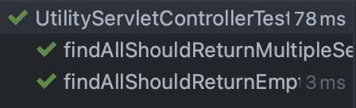

[GitHub repository]: https://github.com/jaflaten/mvc-with-configuration

## Mvc Testing With a Configuration Class

Writing a test for a controller I discovered something I would like to share. What I noticed was that even if my MockMvc test was expecting 200, and my controller returned either 200 or 204, my test failed with a 406. 


### Background
A little bit of background to the problem. This controller was added to a existing project containing countless packages. To run the test i would need to load the application context, but to avoid loading all of it I created a inner static class in my test class. This inner static class serves as a TestApp which is annotated by @ComponentScan and where I tell it which packages to include. In addition this class is annotated with @SpringBootConfiguration which includes, among other annotations, the @Configuration which means that the class is declared as a bean and can be picked up by the Spring container, and therefore found by @ComponentScan. 

The test-class needs annotated with ```@WebAppconfiguration``` and ```@ContextConfiguration```to properly load the application context as the webAppContext is added to the MockMvcBuilders when creating the mockMvc object used in the tests.  I attempted to get this working by annotating the test-class with ```@SpringBootTest(classes = ControllerTest.TestApp.class)``` to tell it to use the inner class. However this did not work as the result was a 406 whenever the controller attempted to return anything with a body. The solution was to remove the ```@SpringBootTest``` annotation and replace it with ```@WebMvcTest``` instead. Below I will explain what this looks like with a few examples. 

If you are unsure or have forgotten what the 200, 204, and 406 HTTP status codes means, here is a short reminder:

- 200 = [Status ok](https://developer.mozilla.org/en-US/docs/Web/HTTP/Status/200)
- 204 = [No Content](https://developer.mozilla.org/en-US/docs/Web/HTTP/Status/204) (response is still ok, but its empty)
- 406 = [Not acceptable](https://developer.mozilla.org/en-US/docs/Web/HTTP/Status/406) ( The content of the response is not matching accepted values. i.e expecting JSON got XML )

---

### The problem

As mentioned at the start of this post the error returned when running the test was a 406, when expecting to have a 200. 

```java
java.lang.AssertionError: Status expected:<200> but was:<406>
Expected :200
Actual   :406
<Click to see difference>

	at org.springframework.test.util.AssertionErrors.fail(AssertionErrors.java:59)
	at org.springframework.test.util.AssertionErrors.assertEquals(AssertionErrors.java:122)
	at org.springframework.test.web.servlet.result.StatusResultMatchers.lambda$matcher$9(StatusResultMatchers.java:627)
	at org.springframework.test.web.servlet.MockMvc$1.andExpect(MockMvc.java:214)
```

The controller calls the service which calls the repository which returns a set of UtilityServlet if the set contains elements, if not it returns a HTTP status 204 no content.


```java
@RestController
@RequestMapping("/api/utility/servlet")
@RequiredArgsConstructor
public class UtilityServletController {

    private final UtilityServletService service;

    @GetMapping(value = "/")
    public ResponseEntity<Set<UtilityServlet>> findAll() {
        Set<UtilityServlet> servlets = service.findAllUtilityServlets();
        return servlets.size() > 0 ? ResponseEntity.ok().body(servlets) : ResponseEntity.noContent().build();
    }
}
```

In the test I wanted to mock the service, and when mocking something the test needs to be told what should happen when the mocked service is called. For this i use ```Mockito.when()``` and return a set of elements. This is useful when you make unit tests because you can isolate the system under testing and not having to worry about finding something in a database.

```java
    @Test
    public void findAllShouldReturnMultipleServlets() throws Exception {
        Set<UtilityServlet> servlets = new HashSet<>();
        servlets.add(servletA);
        servlets.add(servletB);

        Mockito.when(utilityServletService.findAllUtilityServlets()).thenReturn(servlets);
        mockMvc.perform(get("/api/utility/servlet/")
                        .accept(MediaType.APPLICATION_JSON))
                .andExpect(status().isOk())
                .andExpect(content().contentType(MediaType.APPLICATION_JSON));


        verify(utilityServletService, times(1)).findAllUtilityServlets();
    }
```    

The ```status()``` method in the ```.andExpect(status().isOk())```is actually from ```MockMvcResultMatchers```, and the same with ```content()```. These are imported at the top of the class via a static import which exposes those methods and makes them available to use without first specifying the class name. See the [GitHub repository] for examples.

After the API-call has been done and the status code returned I use Mockito again to ensure that the service-method has been called exactly one time. This is done using the ```Mockito.verify()```method. This has also been imported as a static method to make the code shorter and more concise, this is a personal preference.

The TestApp class mentioned above is a inner class within the test class itself and is 

```java
    @ComponentScan(basePackages = {"no.jaflaten.dev.mvcwithconfigurationclass.example"})
    @SpringBootConfiguration
    public static class UtilityServletTestApp {
    }
```

### Solution

To fix the HTTP status 406 and get the 200 OK return code that was expected I had to annotate the test-class with ```@WebMvcTest```. Combined with the other annotations everything is loaded correctly and the test executes as expected. 

```java
@ContextConfiguration
@WebAppConfiguration
@WebMvcTest
public class UtilityServletControllerTest {
```


The test is green!



<!--  -->

The 406 could be correct in some cases if your expected content type is not matching the one that the method returns. In the test shown above I specified that i accepted and expected ```application/json```, but this is not strictly necessary for the test to work. 


I hope this was helpful to you. Thank you for reading. 

> The source code used in this example is available in this [GitHub repository].